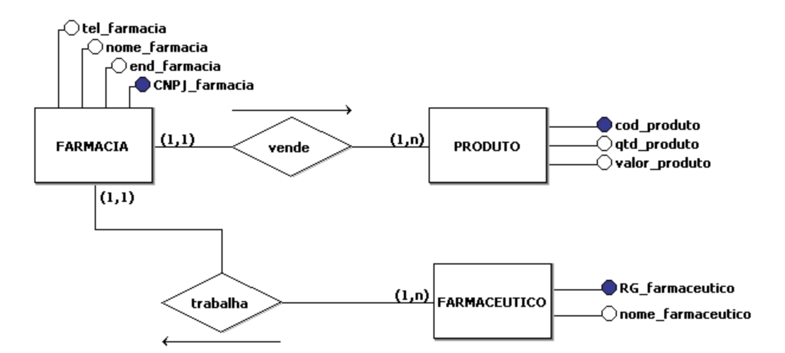

# Gestão de Cantinas

## Objetivo
Desenvolver um aplicativo móvel voltado para gestão de cantinas.

## Objetivos Específicos
- Cadastro de Usuários
- Cadastro de Estoque
- Cadastro de Pedido
- Cadastro de Venda
- Gerar comprovante 

## MER/DER

[](https://www.digitalocean.com/products/app-platform)

### Instalação


```
npm install

npm run start

Link API: http://localhost:80
```